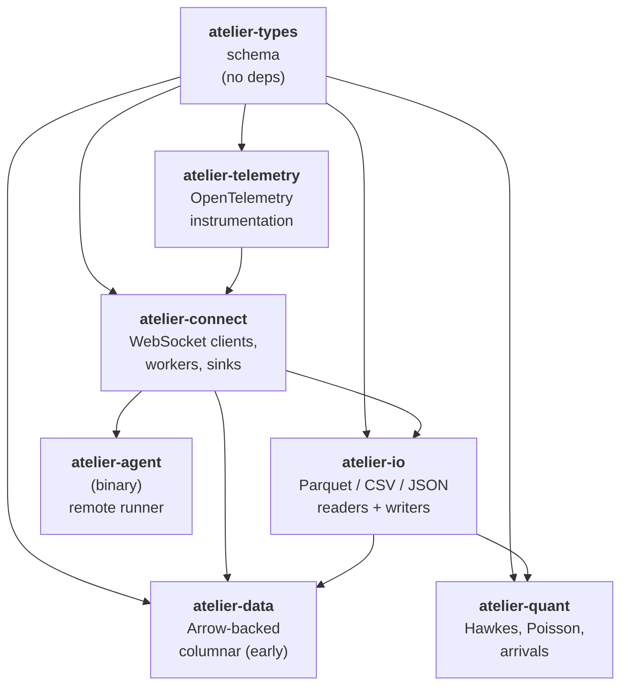
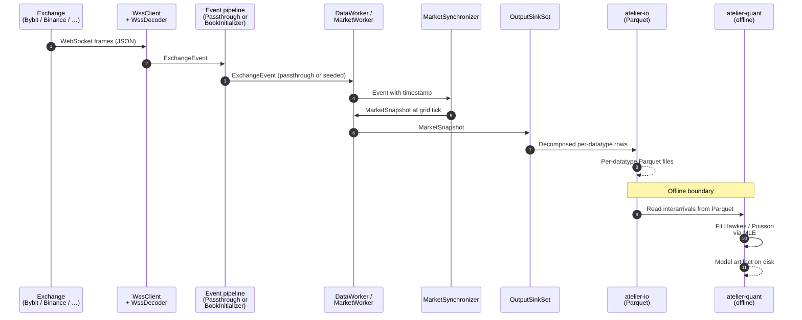

# Architecture

The Atelier SDK is a Cargo workspace of seven crates, six of which
are libraries and one of which is a binary. They are layered so each
layer depends on the ones below and not on the ones above. The story
moves from raw exchange WebSocket traffic at the bottom to fitted
quantitative models at the top, with a single canonical schema layer
in the middle.

## Crate-level dependency graph

`atelier-types` has zero internal dependencies — it is the foundation.
Every other crate depends on it. `atelier-connect`, `atelier-io`, and
`atelier-data` are sibling middle layers that compose. `atelier-quant`
sits at the top, consuming data prepared by the layers below.
`atelier-telemetry` cross-cuts: it instruments `atelier-connect`'s
workers and sinks but is otherwise lightweight. `atelier-agent` is a
deployable binary built on `atelier-connect`'s gateway feature.

## The runtime data path

The offline boundary in step 7-8 is intentional: the live worker
loop and the model-fitting loop are separate processes, separate
schedules, and can run on separate machines. Parquet on disk is the
contract between them.

## Reading the layers

### Layer 1 — schema (`atelier-types`)

Pure type definitions. `Orderbook`, `Trade`, `MarketSnapshot`,
synchronizer modes, error variants. No I/O, no networking, no async.
The single source of truth for what a "trade" looks like across the
SDK.

A change here ripples upward by ordinary type-checking — there is no
risk of two crates inventing their own `Trade`.

See [`atelier-types`](types/index.md).

### Layer 2 — transport (`atelier-connect`, `atelier-data`)

Exchange WebSocket clients with reconnect, backoff, and circuit
breakers. Per-exchange decoders that produce typed `ExchangeEvent`s.
Two worker types: `DataWorker` (raw passthrough) and `MarketWorker`
(synchronized snapshots). Output sinks: channel, terminal, Parquet.

The duplication between `atelier-connect` and `atelier-data` reflects
a transition state — see the
[`atelier-data`](data/index.md) page for current scope and the
intended consolidation.

See [`atelier-connect`](connect/index.md).

### Layer 3 — persistence (`atelier-io`)

Readers and writers for every top-level type, primarily Parquet.
Three traits — `FlushToParquet`, `FlushObSyncToParquet`,
`FlushAggregateToParquet` — that workers call into to persist
streaming output. A filename convention
(`{symbol}_{datatype}_{mode}_{ts}.parquet`) that downstream tools
parse to locate the right files for a given symbol and time range.

See [`atelier-io`](io/index.md).

### Layer 4 — quantitative (`atelier-quant`)

Hawkes and Poisson point-process models with MLE-fitting,
simulation, and goodness-of-fit. Interarrival-time analysis that
bridges raw data into the inputs the models expect. Probability
sampling kit (Uniform, Normal, Poisson, Exponential).

This is the layer most users come to the SDK *for*. The lower
layers exist to feed it.

See [`atelier-quant`](quant/index.md).

### Cross-cutting — telemetry (`atelier-telemetry`)

OpenTelemetry instrumentation. A fixed set of metric names
(`MESSAGES_RECEIVED`, `EVENT_LATENCY_MS`, `WORKER_CONNECTION_STATE`,
`SINK_QUEUE_DEPTH`) shared across all workers and sinks so a single
operator dashboard can consume telemetry from anywhere in the SDK.

See [`atelier-telemetry`](telemetry/index.md).

### Deployable — agent (`atelier-agent`)

Binary-only. Remote agent that connects to the Atelier Gateway over
JWT, accepts work assignments, spawns workers, streams telemetry
back. Documented in [Operations → atelier-agent](../operations/agent.md)
since it has no library API.

## Three reading paths

Most readers want one of:

- **"I want to collect live data."** Start with [Getting started](getting-started.md),
  then [Tutorial 1: Bybit → Parquet](../guides/01-bybit-to-parquet.md).
- **"I want to do something cross-exchange."** Read [`atelier-connect`](connect/index.md),
  then [Tutorial 2: multi-exchange sync](../guides/02-multi-exchange-sync.md).
- **"I want to fit a model on data I already have."** Skip the
  connectivity layer. Read [`atelier-quant`](quant/index.md), then
  [Tutorial 3: Hawkes on arrivals](../guides/03-hawkes-on-arrivals.md).

For everything else, the [API reference](api/index.md) is the
exhaustive view, organized by crate.
