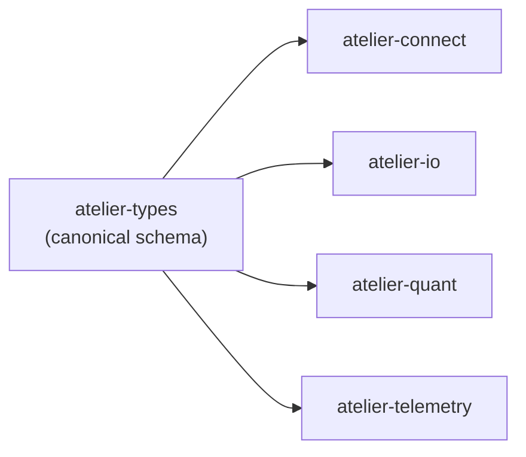

# `atelier-types`

The canonical schema layer for the Atelier SDK. Every other workspace
crate — connectivity, persistence, quantitative models, telemetry —
consumes the types defined here. There is **no I/O and no networking**
in this crate; it is pure type definitions, builders, validators, and
serialization.

Treating the schema as a single, dependency-free crate keeps the rest
of the workspace honest: a change to the wire shape of `Trade` or
`Orderbook` can only happen here, and ripples outward through normal
type-checking. There is no risk of `atelier-connect` and `atelier-io`
inventing their own incompatible variants.

## Where it sits



Every other crate depends on this one. Nothing depends on this one
that this one needs back.

## Type families

### Order book

| Type              | Purpose                                                           |
|-------------------|-------------------------------------------------------------------|
| `Orderbook`       | BTreeMap-backed limit order book, `Decimal`-precision prices      |
| `Level`           | Single price level with aggregate quantity                        |
| `Order`           | Individual order: side, type, metadata                            |
| `OrderSide`       | `Buy` / `Sell`                                                    |
| `OrderType`       | `Market` / `Limit` / etc.                                         |
| `OrderbookDelta`  | Incremental update to orderbook state                             |
| `NormalizedDelta` | Cross-exchange consistent delta format                            |

### Market data

| Type            | Purpose                                                              |
|-----------------|----------------------------------------------------------------------|
| `Trade`         | Public trade — price, quantity, timestamp, taker side                |
| `FundingRate`   | Perpetual funding rate observation                                   |
| `Liquidation`   | Forced-liquidation event with size, price, exchange metadata         |
| `OpenInterest`  | Aggregate open interest snapshot                                     |

### Synchronization & snapshots

| Type                  | Purpose                                                                       |
|-----------------------|-------------------------------------------------------------------------------|
| `MarketSnapshot`      | Time-aligned bundle of all market data for one grid period                    |
| `MarketAggregate`     | 15-scalar feature vector derived from a `MarketSnapshot`                      |
| `EventSynchronizer`   | Timestamp-based event ordering with 4 clock modes                              |
| `MarketSynchronizer`  | Aggregates multi-source events into synchronized snapshots                    |

The four clock modes are documented in detail on the
[`atelier-connect`](../connect/index.md) page, since the synchronizer's
runtime behaviour is most relevant in the context of the workers.

### Configuration

| Type                    | Purpose                                                          |
|-------------------------|------------------------------------------------------------------|
| `MarketSnapshotConfig`  | Selects which data sources go into a snapshot                    |
| `WorkerManifest`        | TOML-driven pipeline configuration for multi-worker runs         |

### Errors

| Variant                                | Returned when                                          |
|----------------------------------------|--------------------------------------------------------|
| `OrderbookError`                       | LOB operation failures                                 |
| `PersistError`                         | Serialization / deserialization errors                 |
| `TemporalError`                        | Timestamp validation failures (out-of-order, future)   |
| `ConfigError`                          | Configuration parsing                                  |

All errors derive `thiserror::Error`. Most return-types in the SDK use
`Result<T, atelier_types::errors::*>` directly.

## Quick start — build an orderbook and apply a delta

```rust
use atelier_types::orderbook::{Orderbook, OrderbookDelta, OrderSide};
use rust_decimal::Decimal;
use chrono::Utc;

// Create a new orderbook
let mut ob = Orderbook::new("BTCUSD".to_string());

// Apply a delta to add orders
let delta = OrderbookDelta::builder()
    .timestamp(Utc::now())
    .sequence(1)
    .side(OrderSide::Buy)
    .price(Decimal::new(50000, 0))
    .quantity(Decimal::new(10, 0))
    .build()?;

ob.apply_delta(delta)?;

// Query the best bid
if let Some(best_bid) = ob.best_bid() {
    println!("Best bid: {} @ {}", best_bid.quantity, best_bid.price);
}
```

## Quick start — multi-source snapshot

```rust
use atelier_types::snapshot::{MarketSnapshot, MarketSnapshotConfig};
use chrono::Utc;

let config = MarketSnapshotConfig::default()
    .with_orderbook(true)
    .with_trades(true)
    .with_funding_rates(true);

let snapshot = MarketSnapshot::builder()
    .timestamp(Utc::now())
    .symbol("BTCUSD".to_string())
    .config(config)
    .build()?;
```

## Where to go next

- [API reference for `atelier-types`](../api/atelier-types/index.md) — every public item.
- [`atelier-connect`](../connect/index.md) — how these types flow out of live exchange feeds.
- [`atelier-io`](../io/index.md) — how they get persisted to Parquet / CSV / JSON.
- [Architecture](../architecture.md) — the cross-crate picture.
