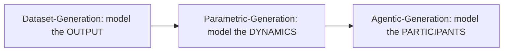
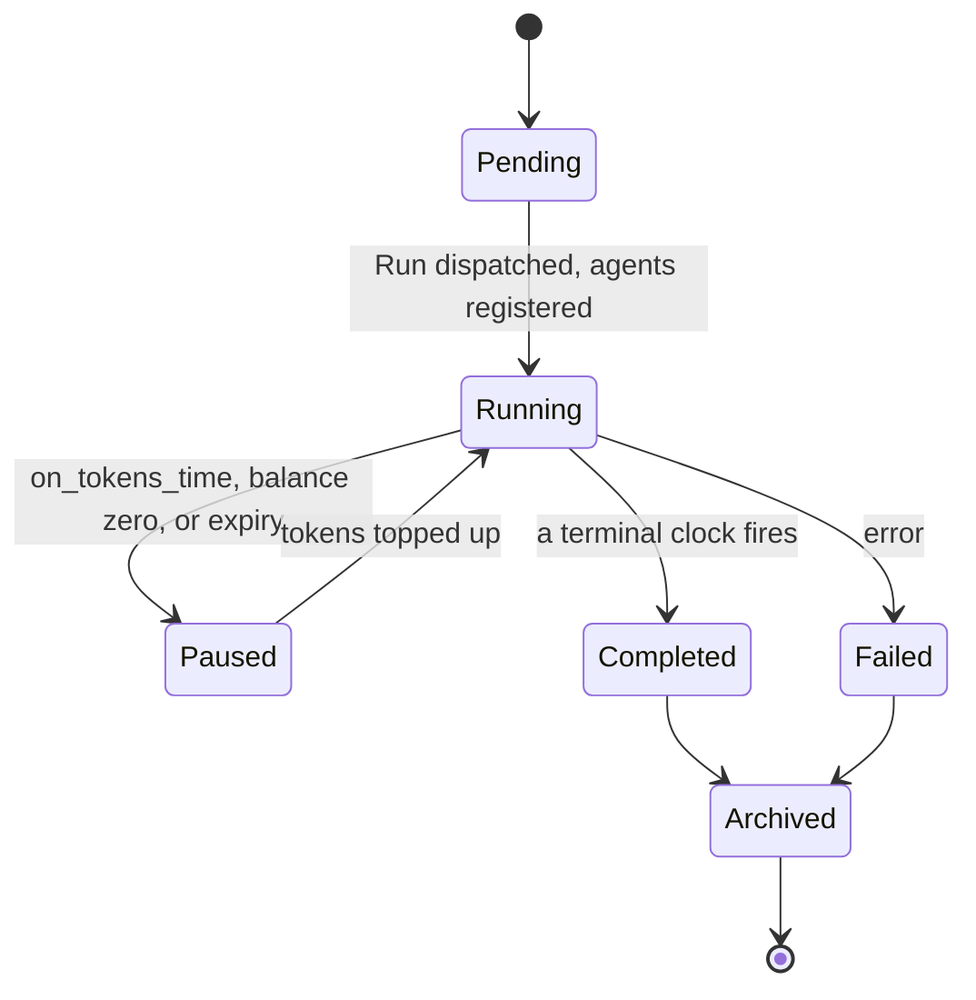
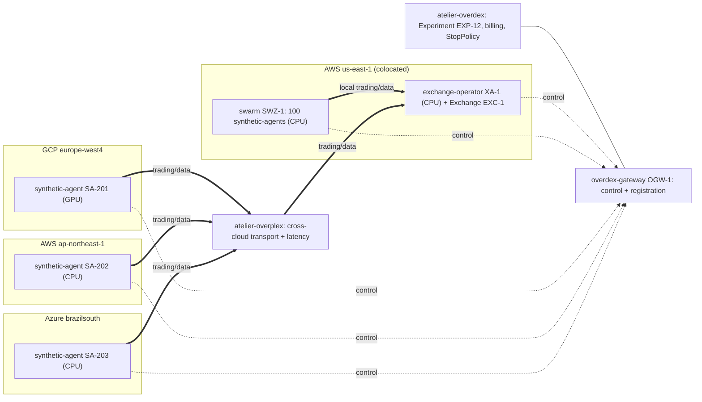
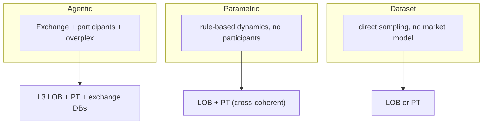

# Atelier Engine - Use Case 2: Synthetic Data Generation Engine (Experiment)

Status: forward, non-normative. Targets a version beyond v0.1-beta-2.

This document is a design narrative. It seeds a later taxonomy (txy) and state-machine (fsm) formalization, then implementation. Where a term already exists in the main taxonomy, this document defers to it. Where a term is new, this document proposes it and marks it NEW.

Companion to `use-case.md` (Use Case 1: BYO-Infra Market Data Collection, a Service). Use Case 1 is a Service (unbounded, Overseer). Use Case 2 is an Experiment (bounded, Overdex).

---

## 1. What this is

- Introduces the **Experiment** activation mode, built for the first time (defined-but-deferred in v0.1-beta-2).
- Defines the **Synthetic Data Generation Engine**: bounded, reproducible, billed generation runs.
- Host split: **atelier-overdex** orchestrates Experiments; **atelier-overseer** keeps owning live Services.
- Repo split: types in **atelier-sdk**; generation + orchestration + billing in **atelier-overdex**; cross-cloud networking + latency in **atelier-overplex**.
- Billing unit: **GeneratorTokens**.

Concern separation:

- Service = indefinite operation = Overseer.
- Experiment = ephemeral, stop-policy-driven = Overdex.

---

## 2. New terms (to formalize in txy + fsm)

| Term | Kind | One line |
|---|---|---|
| Experiment | activation mode | bounded, ephemeral, ends on a StopPolicy; symmetric to Service where possible |
| Overdex orchestrator | System Process | the Experiment orchestrator, peer to the Overseer |
| overdex-gateway | System Process | Experiment trust + registration boundary; inherits the overseer's `atelier-gateway` |
| synthetic-agent | Agent (formal) | a simulated market participant; experiment-scoped; Registers, holds Skills, Binds, occupies a ComputeSlot |
| Exchange | entity | the synthetic exchange: matching engine + Trading/Data/Account APIs |
| exchange-operator | Agent (platform-agent) | the agent that runs the Exchange |
| Trading API / Data API / Account API | interfaces | order open/modify/cancel / market-data queries / balances + fees |
| StopPolicy | construct | the set of clocks that end or pause an Experiment |
| on_wall_time / on_engine_time / on_agent_time / on_synthetic_time / on_artifact_time / on_metric_time | clocks (terminal) | thresholds that complete an Experiment |
| on_tokens_time | clock (pause) | GeneratorToken budget; pauses, does not end |
| GeneratorTokens | billing unit | what generation Experiments consume |
| compute-class / GPUComputeSlot | ComputeSlot attribute | CPU, Nvidia-CUDA, or Apple-Metal/MPS |
| ComputeProfile | Agent capability | backend + device, advertised at Registration, matched like Skills |
| participant Skills | Skills (new) | Observe, Decide, Trade, Account |
| exchange Skills | Skills (new) | Match, ServeData, ServeTrading, ServeAccount |
| overplex networking | infrastructure | cross-cloud transport + participant-to-exchange latency model |

Agent family (typed prefix; all are formal Agents):

| Agent | Role | Controlled by | Lifetime | Domain |
|---|---|---|---|---|
| platform-agent | executor | company (private) | persistent | Platform |
| remote-agent | executor | user (public or private) | persistent | Remote |
| synthetic-agent | market participant | its strategy / experiment def | experiment-scoped | simulation |
| onchain-agent (future) | executor | public / blockchain | persistent | Blockchain (new) |

---

## 3. Reading the synthetic engine end-to-end

1. A client opens a **Session**; the **Overdex** **Runs** an **Experiment** instead of Deploying a Service.
2. The Experiment declares a **kind** (Dataset, Parametric, or Agentic), a **StopPolicy**, a **seed**, and a **GeneratorToken** budget.
3. Overdex reserves GeneratorTokens, then dispatches **Manifests** that **Bind** **Agents** to **Workspaces** and **Assign** **Tasks** to **ComputeSlots** (CPU or GPU).
4. For Agentic runs, agents Register through the **overdex-gateway**; an **exchange-operator** runs the **Exchange** (matching engine + Trading/Data/Account APIs); **synthetic-agents** trade through it.
5. Distributed agents reach the Exchange over **overplex**, which applies a per-participant **latency** model.
6. Each ComputeSlot **Emits** **Artifacts** tagged with the **Experiment ID**: a Market-Dataset (LOB and/or Public Trades) and, for Agentic, the exchange-protocol DBs.
7. Overdex meters GeneratorTokens by compute-class x time. `on_tokens_time` pauses the run; a terminal clock completes it.
8. On completion the Experiment drains, finalizes Artifacts, settles tokens, and **Archives** under the Experiment ID. The run is reproducible from (seed + params + engine_version + input hash).

---

## 4. The fidelity ladder (three generation kinds)



Increasing left to right: realism, internal consistency, output richness, compute cost.

| Kind | Models | Inputs | Outputs | Compute | Internal consistency |
|---|---|---|---|---|---|
| Dataset | the output distribution | a fit ModelArtifact or a parameter set | Market-Dataset: LOB (L1/L2/L3) or full Public Trades | CPU, inline | may be partial |
| Parametric | market dynamics by formula | a formula / parameter config | Market-Dataset: LOB + Public Trades, cross-coherent | CPU, inline or async | by construction |
| Agentic | autonomous participants | initial LOB snapshot + exchange config + participant population + strategies | L3 LOB + full Public Trades + exchange-protocol DBs | CPU + GPU, distributed | emergent |

Market-Dataset (LOB / Public Trades) is the shared output of all three. Only Agentic adds the exchange-protocol DBs (orders, fills, accounts, positions).

---

## 5. Experiment lifecycle



StopPolicy = a set of clocks. First clock to reach its limit wins. Terminal clocks complete; the token clock pauses.

| Clock | Counts | Effect |
|---|---|---|
| on_wall_time | elapsed real seconds | terminal |
| on_engine_time | matching-engine events | terminal |
| on_agent_time | synthetic-agent actions (aggregate or a chosen agent) | terminal |
| on_synthetic_time | generated market time (the data's own timeline) | terminal |
| on_artifact_time | artifacts by type (multi-target, first wins) | terminal |
| on_metric_time | a scalar observable reaches a target | terminal |
| on_tokens_time | GeneratorTokens consumed | pause |

Rules:

- No StopPolicy configured: stop on the solvency backstop only (balance zero or token expiry), which pauses.
- `on_metric_time` must co-require at least one bounded clock - a metric may never fire.
- GeneratorTokens: reserve at start, settle at end. Burn = compute-class x time (CPU 1x, Nvidia Nx, Apple Mx).
- Token exhaustion (budget, balance zero, or expiry) pauses and is resumable; only a terminal clock or an explicit Stop/Delete completes.
- Reproducible: (seed + params + engine_version + input hash) -> identical output. Async participants are ordered by a deterministic seeded event queue.

---

## 6. Flagship use case: an Agentic-Generation Experiment

Goal: generate a synthetic crypto market with 103 participants across four clouds, producing L3 LOB, full Public Trades, and the exchange-protocol DBs.

### 6.1 Participants and placement

- 1 exchange-operator + 1 swarm of 100 synthetic-agents, colocated with the Exchange.
- 3 distributed synthetic-agents, one per cloud/region, one of them on GPU.

| Entity | Role | Cloud / Region | Compute | Packaging | Skills |
|---|---|---|---|---|---|
| XA-1 | exchange-operator | AWS us-east-1 | CPU | single container | Match, ServeData, ServeTrading, ServeAccount, Emit, Report |
| SWZ-1 | swarm: 100 synthetic-agents | AWS us-east-1 (colocated) | CPU | one container, 100 ComputeSlots | Observe, Decide, Trade, Account, Report |
| SA-201 | synthetic-agent | GCP europe-west4 | GPU (Nvidia) | single container | Observe, Decide, Trade, Account, Report |
| SA-202 | synthetic-agent | AWS ap-northeast-1 | CPU | single container | Observe, Decide, Trade, Account, Report |
| SA-203 | synthetic-agent | Azure brazilsouth | CPU | single container | Observe, Decide, Trade, Account, Report |



Latency (modeled by overplex, illustrative): colocated swarm tens of microseconds; SA-201 ~80 ms; SA-202 ~150 ms; SA-203 ~120 ms.

### 6.2 Procedure

1. Session and Experiment
   - Authenticate. Overdex checks subsystems and the GeneratorToken balance.
   - Session `SES-204`: envelope of agents, ComputeSlots, GPU quota.
   - Experiment `EXP-12`: Run of Pipeline `PIP-9` (agentic-market), scoped to `SES-204`, kind Agentic, seed fixed.
   - StopPolicy: first_to_fire(`on_synthetic_time` = 6h market, `on_artifact_time` = 5,000,000 trades); `on_tokens_time` = 5,000,000 GeneratorTokens (pause).
   - Reserve 5,000,000 GeneratorTokens.

2. Manifest, Tasks, Bindings
   - Manifest `MAN-31` composes: `XA-1` + `SWZ-1` (100) + `SA-201/202/203`.
   - Tasks: `TSK-EXC` (exchange Skills, CPU slot), `TSK-SWARM` (participant Skills, 100 CPU slots), `TSK-201` (participant Skills, GPU slot), `TSK-202` / `TSK-203` (participant Skills, CPU slots).
   - Provision Workspaces + ComputeSlots; a GPUComputeSlot for `SA-201`.
   - Bindings pending. overdex-gateway mints a per-agent JWT scoped to `EXP-12`.

3. Registration and distribution
   - Deploy containers: `XA-1` + `SWZ-1` in AWS us-east-1; `SA-201` (GCP), `SA-202` (AWS Tokyo), `SA-203` (Azure Sao Paulo).
   - Each agent connects outbound to `OGW-1`, advertising Skills + ComputeProfile.
   - Overdex validates Skills + compute-class, activates Bindings, Assigns Tasks to ComputeSlots.
   - overplex establishes cross-cloud transport and applies the latency model.

4. Execution (the trade loop)

```mermaid
sequenceDiagram
  participant P as synthetic-agent
  participant N as overplex
  participant X as Exchange
  X-->>N: Data API market data
  N-->>P: market data after latency
  P->>P: Decide (strategy; GPU if learned)
  P->>N: Trading API open/modify/cancel
  N->>X: order after latency
  X->>X: Match (price-time priority)
  X-->>N: fill + book update
  N-->>P: fill, Account API state
  X->>X: Emit L3 LOB + Public Trades + exchange DBs
```

   - The Exchange seeds the book from the initial LOB snapshot.
   - Participants loop: Observe (Data API) -> Decide -> Trade (Trading API) -> matching engine Matches -> fills + book updates -> Account API.
   - The swarm trades at near-zero latency; the three distributed agents trade under their modeled latency.
   - The Exchange Emits L3 LOB, full Public Trades, and exchange-protocol DB rows. Telemetry streams to the webapp via `OGW-1`.

5. StopPolicy in action
   - Overdex meters GeneratorTokens by class x time; `SA-201` (GPU) burns fastest.
   - If `on_tokens_time` hits 5,000,000 before a terminal clock: Experiment -> Paused (checkpoint). Top up -> Resume.
   - The first terminal clock to fire (6h market time or 5,000,000 trades) completes the run.

6. Completion, artifacts, archive
   - Drain: agents finalize in-flight orders; the Exchange flushes the final book, trades, and DBs.
   - Settle GeneratorTokens (reserved minus actual).
   - Artifacts, tagged `EXP-12`:

   | Artifact | Type | Sink |
   |---|---|---|
   | L3 LOB | DataArtifact | ObjectSink (Parquet) |
   | Public Trades (full detail) | DataArtifact | ObjectSink (Parquet) |
   | orders / fills / accounts / positions | exchange-protocol DBs | DBSink (ClickHouse) |
   | per-participant decision logs | LogsArtifact | ObjectSink (optional) |

   - Experiment -> Completed -> Archived. Lineage preserved under `EXP-12`.

7. Composition (the payoff)
   - Seed from a Service: the initial LOB snapshot comes from a live data-collection Service's DataArtifacts (real BTC-USDT book), or from a prior Dataset-Generation run.
   - Real strategy joins the synthetic market: a user's **remote-agent** registers to the same `overdex-gateway` and trades in `EXC-1` alongside the synthetic-agents, indistinguishable to the Exchange (same wire protocol). The researcher backtests a real bot inside a synthetic, latency-realistic market.

---

## 7. Dataset and Parametric as reductions

Both reuse the Experiment lifecycle, StopPolicy, and GeneratorTokens. Both skip overdex-gateway and overplex (no distributed agents, no Exchange).

- Dataset-Generation: no Exchange, no participants. Overdex samples LOB or Public Trades directly from a fit ModelArtifact or a parameter set, inline on CPU. Cheapest; may lack cross-event consistency.
- Parametric-Generation: no participants. Overdex runs a rule-based market model (e.g. a price SDE plus a parametric order-flow process feeding a book) inline or async on CPU. Cross-coherent by construction; no free will.



---

## 8. Forward notes

- onchain-agent: a future fourth agent type and a third Domain (Blockchain / Public). It could trade in a synthetic or a real exchange as a public, possibly publicly-controlled participant.
- Platform Apple Silicon: the Platform x Apple-Metal cell needs Mac nodes in the platform fleet (EC2 Mac or colo). Define the cell; gate execution on hardware, not on the spec. Remote Apple (a researcher's own Mac) is natural from day one.
- Scale: population scale is carried by swarm-in-one-container plus multiplexed in-process channels. Single-container agents are for distinguished or external participants (e.g. a GPU strategy, or a real remote-agent).
- Reproducibility contract: record seed, params, engine_version, and input hash on every Experiment. Async participant actions are ordered by a deterministic seeded event queue so a re-run is bit-identical.
- Symmetry to confirm during fsm formalization: Experiment vs Service drain/recover (a short reproducible run re-runs from seed; a long agentic run checkpoints and resumes), and the Archive terminal state (Experiment-only).

---

## 9. Open items for the txy + fsm session

- Define the Experiment FSM and the SEQ-E1 (Run) sequence, plus completion -> archive and pause/resume.
- Add participant Skills (Observe, Decide, Trade, Account) and exchange Skills (Match, ServeData, ServeTrading, ServeAccount) to the Skill taxonomy.
- Add compute-class and GPUComputeSlot to the ComputeSlot model; add ComputeProfile to Registration and to the Assign-time match.
- Give synthetic-agent its own taxonomy entry (formal Agent, experiment-scoped) and define the Exchange entity.
- Specify the overdex-gateway (inherits atelier-gateway) and the overplex networking + latency model.
- Define on_agent_time counting (aggregate vs chosen agent), on_artifact_time multi-target, and the on_metric_time observable catalog (posted volume, traded notional, stylized-fact statistics) with cross vs converge semantics.
